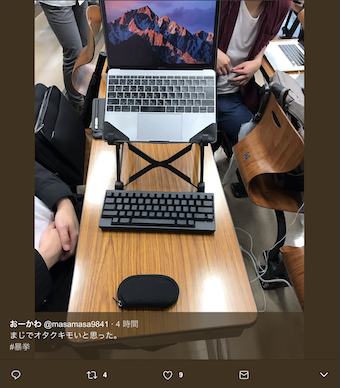

### まじで
### オタクキモいと
### 思われた
## -快適なノート環境を目指して-

千葉工業大学 情報科学専攻 滝 雄太郎

---

## 自己紹介

* 名前 : 滝 雄太郎
* 年齢 : もう少しで24才
* 所属 : 情報科学専攻 藤田研究室
* Twitter : @takion0

---

## はじめに

今朝のツイート

キモいと思われてしまった

---

## キモいと思われた環境

---

## 内訳

* PCスタンド
* HHKB BT
* Magic Mouse2
* iPad Pro

機器のチョイスに他意はありません

---

## キモいと思われた環境

---

## 良くなった点

* 首と肩が楽に
* 指への負担が減った

---

## 悪くなった点

* 書き始めるのに手間がかかる
* マウスの使い心地は良くない
* 持ち物が増えた

---

## 終わりに

* ノートPCの環境を整えた
* PCスタンドを導入するだけでも変わります

良きPCライフを！！